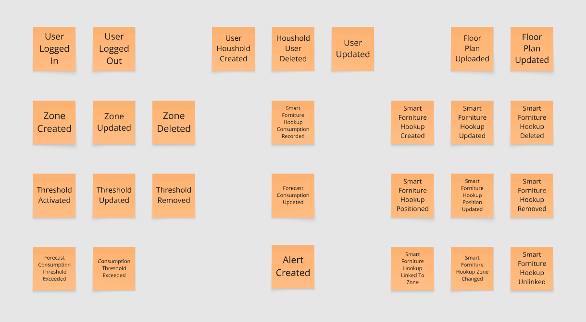
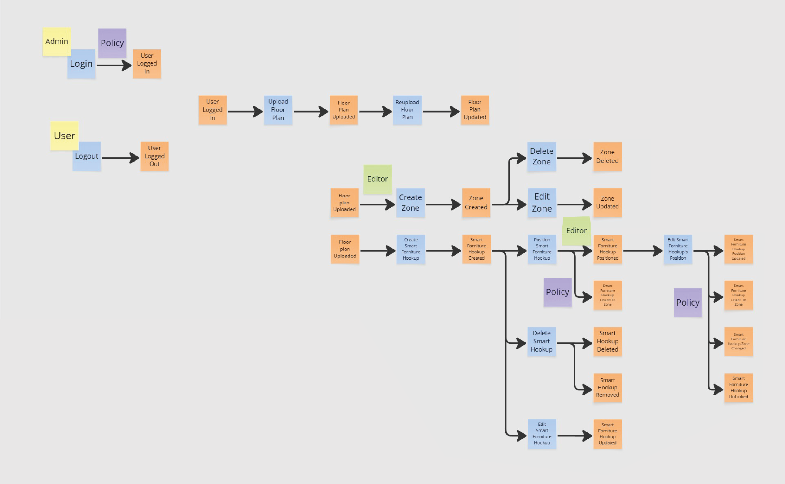

The knowledge crunching session was conducted using the Event Storming approach, which facilitates collaboration
between developers and domain experts in defining the project's domain. By mapping out actors,
domain events, commands, and views/read models with color-coded stickies, the team achieved a comprehensive,
shared understanding of the system. This entire process laid the groundwork for producing the final context map.

## Step 1: Identify Domain Events
The following main domain events were identified during our Event Storming session:

## Step 2: Timeline, User Actions, External Systems and Business Policy
Here, we identify the Timeline, User Actions, external systems, and business policy that constitute the
system's interactions:

## Step 3: Aggregates
Next, we identify aggregates, which bundle related domain events and commands by entity:

